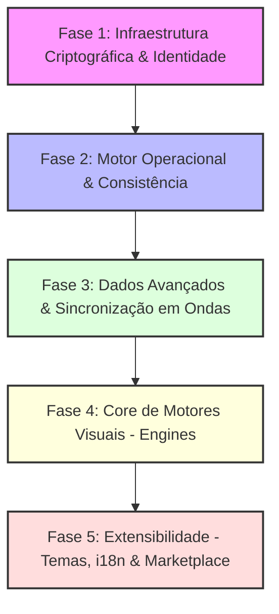

Este documento descreve o plano de desenvolvimento e o backlog de tarefas técnicas da Plataforma Projeto SuperApp V0.41, organizados em 5 fases sequenciais.

---

## 1. Cronograma de Fases

O cronograma de implementação do Superapp Projeto SuperApp V0.41 está organizado de forma a consolidar a base criptográfica e a consistência do banco de dados antes de desenvolver os motores visuais avançados e a customização dinâmica:

---

## 2. Detalhamento Técnico das Fases

### Fase 1: Infraestrutura Criptográfica, Identidade e Segurança
*Foco: Estabelecer a identidade do usuário e as chaves locais antes de sincronizar ou projetar dados.*
* **Tarefas**:
  * **Identidade Local & BIP39**: Derivação de chaves Ed25519 a partir de seed phrases (12/24 palavras). Cifragem local com a chave do dispositivo via PBKDF2.
  * **Separação UCAN / Key Vault**: Implementação do fluxo de tokens UCAN estritamente como provas de autorização (sem material de chaves no payload) e o subsistema Key Vault no Crypto Worker para entrega de chaves de época baseada no TTL do papel ativo.
  * **Ontologia de Permissões Projeto SuperApp V0.41**: Criação de `ASSET:PERMISSION` (queries de traversal com profundidade limite $\le$ 6 e restrições de mutação) e `ASSET:ROLE` com as arestas estruturais `AGGREGATES` e `REQUIRES` conectadas ao `entity_id` estável.
  * **Templates In-Spec**: Inclusão de moldes de papéis e permissões sob chaves `permission_templates` e `role_templates` embutidos nos payloads de `SPECIFICATION`s.
  * **Recuperação Shamir (SSS)**: Divisão de chaves 2-de-3 (Dispositivo, Provedor/Fundador, Canal Externo).

### Fase 2: Motor Operacional e Consistência (MFA-S e Validação)
*Foco: Regras de negócio inalteráveis e auditoria semântica.*
* **Tarefas**:
  * **Validador de Domínio**: Interpretador genérico para avaliar a `SPECIFICATION` vinculada ao nó via JSONSchema, JSONLogic ou WASM.
  * **Ciclo de Intenção (serialização por linhagem, v4)**: Pipeline ligando a escrita otimista (comutativa) com a suspensa não-comutativa: `CONTENT:INTENT` com arestas `SPENDS` (head de origem) e `CREDITS` (entity_id de destino), aguardando `APPROVED_BY` do validador declarado da linhagem e `RESOLVES` para fechar; saldos resultantes via `MUTATES` + `RESULTED_FROM` → intent. Invariante de não-conflito no core; política (K, leader/quorum, conjunto) na SPEC do ativo. Ver caderno-4/03 §3.5.
  * **[[mfa-s|MFA-S]] (Multi-Factor Audit Semantic)**: Coalescência em RAM das Changes do Automerge na tabela `pending_changes` e consolidação em nós do grafo.
  * **Viagem no Tempo e Undo**: Undo semântico via logs históricos.

### Fase 3: Camada de Dados Avançada e Sincronização
*Foco: Sincronização de baixo tráfego e performance do OPFS.*
* **Tarefas**:
  * **Projeções e Índices**: triggers SQLite para FTS5 (`search_index_fts`), geolocalização (`geo_index` via R*Tree) e agregadores de saldo de ativos (`asset_balances`).
  * **Sync em Ondas**: Agendamento de downloads (Onda 0: Identidade e Specs; Onda 1: Dados quentes; Onda 2: Metadados podados; Onda 3: Reidratação seletiva).
  * **Graph-Based Routing**: Reidratação de cascas (`retention_state = 'pruned'`) via requisições WebRTC ponto-a-ponto (`REQUEST_NODES`).
  * **GC Híbrido (G4)**: Poda de dados antigos respeitando pins (`ASSET:PIN`) e limites regulatórios.

### Fase 4: Core de Motores Visuais (Engines do Padrão A)
*Foco: Motores polimórficos e reusabilidade visando responsividade.*
* **Tarefas**:
  * **Coleção**: Desenvolver `Layout` engine (grades/listas com virtualização), `Filter` (interpretador JSON) e `Entity Picker` (autocomplete via FTS5).
  * **Entidade e Formulário**: `SuperCard` polimórfico, `AssetCard` de mídias criptografadas e `SmartForm` dirigido por especificações.
  * **Interação e Processo**: `Composer` (rich input), `ContextMenu`, `BottomSheet`, `StateMachine` (Kanban/Stepper) e `AuditTrail` (linha do tempo MFA-S).
  * **Especializados**: `GeoSpatial` (mapa Geographic/Cartesian), `RelationGraph` e `WorkspaceShell`.

### Fase 5: Extensibilidade Dinâmica (Temas, i18n e Marketplace)
*Foco: Customizações como dados governados pelo grafo.*
* **Tarefas**:
  * **Temas**: Nós `CONTENT:THEME` com injeção dinâmica de CSS Custom Properties (HSL).
  * **Internacionalização**: Nós `CONTENT:TRANSLATION` reativos sincronizados via P2P.
  * **Marketplace**: Catálogo curado para busca e validação de temas e traduções.

---

## 3. Plano de Verificação e Qualidade
* **Testes Automatizados (Vitest)**: Cobertura de cifragem, assinaturas, verificação UCAN e teste de integridade de linhagem.
* **Testes de Integração (Cypress / Playwright)**: Validar reatividade do TinyBase e latência de reidratação sob conexões degradadas.
* **Testes de Acessibilidade**: Validação manual das engines com navegação por teclado e leitores de tela.

---

## 4. Backlog de Refinamento Projeto SuperApp V0.41 (Trabalho em Aberto)

Tarefas prioritárias identificadas para consolidação da arquitetura Projeto SuperApp V0.41:
* **Auditoria de Relações em Payload**: Varredura sistemática para garantir que arestas estruturais e de controle de acesso (como `AGGREGATES` e `REQUIRES`) residam estritamente no grafo físico indexado, nunca embutidas de forma oculta nos payloads cifrados dos nós.
* **Definição de `validation_policy` por Permissão**: Estruturação de políticas de validação associadas a cada `ASSET:PERMISSION` para parametrizar regras executadas pelo Zen Engine por permissão.
* **Meta-SPEC para Procedimentos Zen Engine**: Definição da especificação formal dos cabeçalhos e contratos de entrada/saída para os validadores e procedimentos executáveis em WASM.
* **Limites de Performance do Zen Engine**: Benchmark e testes de estresse do interpretador WASM no Sync Worker em navegadores móveis sob restrição extrema de CPU e memória.
* **Medição de Contribuição (4 regimes)**: recibos de banda assinados por contraparte; desafio-resposta de storage; amostragem de compute determinístico; aceitação para compute não-determinístico. Agregação por sessão/época em `ASSET:BALANCE_STATE` de contribuição. Ver RFC §3.3.
* **Economia-como-Módulo**: core mede (verificável), SPEC liquida (crédito/fiat/reputação) via Zen Engine. Múltiplas economias sobre o mesmo mecanismo de ASSET.
* **Defesa Sybil opt-in (P2P puro)**: `ASSET:INVITE` finito gateado por standing; staking social do convidante; irrelevância por diversidade; bond para papéis privilegiados. Módulos via SPEC, desligados em redes com autoridade.
* **Desafios de integridade do agente (canary)**: suíte de honeypots, forte no determinístico; integridade-como-serviço nas modalidades gerenciadas. Ver caderno-2/02 §1.6.
* **Trabalho em aberto declarado:** transferência atômica entre tipos/emissores de ativo distintos; registro canônico global para dicionarização de `type`; verificação trustless de compute não-determinístico (fica como mercado de reputação).

