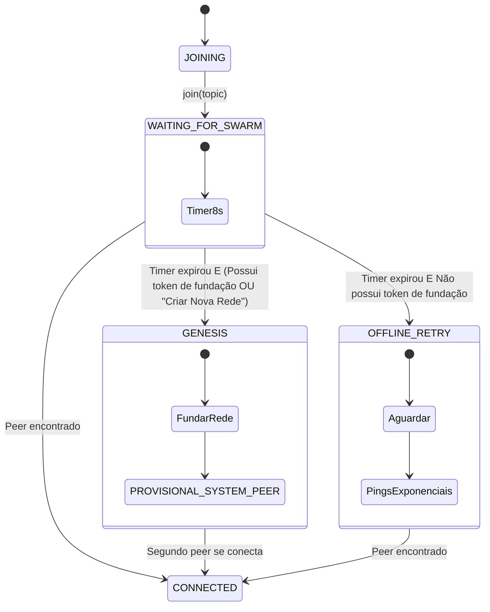

# First Peer Protocol

O **First Peer Protocol** é a máquina de estados executada pelo [[swarm-registry]] quando um peer tenta ingressar em um swarm e não detecta nenhum outro participante ativo na rede. Ele coordena o processo de cold start da topologia P2P de forma determinística, decidindo se o peer deve fundar um novo estado de gênese (se autorizado) ou entrar em modo de busca passiva com recuo exponencial.

---

## Por quê ([[vision]])

Em redes locais descentralizadas e baseadas em [[local-first]], a inicialização de um swarm apresenta o desafio clássico do "cold start". Sem um servidor central de coordenação autoritativo, o First Peer Protocol resolve o dilema de bootstrap evitando a criação acidental de swarms paralelos e desconectados ("split-brain") sem autorização explícita. Ele garante o [[pragmatismo-topologico]]: a rede só é fundada por um peer que possui permissões de bootstrap, enquanto outros participantes aguardam de forma eficiente para se conectar a uma rede preexistente.

---

## Contrato ([[protocol]])

O protocolo executa uma máquina de estados com fluxo determinístico e limites temporais estritos para a descoberta de rede:

### Estados do Protocolo

*   **JOINING**: Invoca o comando `join(topic)` e dispara buscas em paralelo através de múltiplos meios de transporte disponíveis (mDNS em rede local, DHT em rede global e fallback WebSocket).
*   **WAITING_FOR_SWARM**: Inicia um timer com duração de **8 segundos**. Este tempo é calculado para cobrir a latência típica dos diferentes transportes:
    *   Resposta em rede local via mDNS: < 1 s.
    *   Descoberta em rede global via DHT: < 3 s.
    *   Conexão por fallback WebSocket: < 5 s.
*   **CONNECTED**: Transição disparada caso um peer válido seja encontrado durante o tempo de espera. O nó passa a operar sob sincronização normal.
*   **GENESIS**: Atingido se o timer de 8 segundos expirar sem a detecção de peers, e o nó cumprir uma das seguintes condições:
    *   Deter o **bootstrap token** (chave criptográfica de fundação gerada na criação do workspace).
    *   O usuário acionar explicitamente a opção "Criar Nova Rede" via interface.
    
    Durante o estado `GENESIS`, o peer executa a fundação:
    1. Instancia o [[genesis-state]] local com o `[[profile]]` do administrador e a `[[specification]]` inicial do workspace.
    2. Grava de forma imutável o nó `[[specification-network-birth]]` no grafo.
    3. Anuncia-se na DHT como seed para o tópico correspondente.
    4. Assume temporariamente a flag `PROVISIONAL_SYSTEM_PEER` no [[swarm-registry]].
*   **OFFLINE_RETRY**: Atingido se o timer de 8 segundos expirar sem peers detectados e sem que o nó possua chaves de fundação. O Sync Worker suspende a busca ativa por DHT/mDNS para poupar recursos e inicia pings exponenciais no canal de fallback WebSocket (com intervalos de 10 s → 20 s → 40 s → máximo de 60 s). A interface entra em estado suspenso exibindo "Aguardando conexão com a rede...".

### Transição de Gênese a Operação Normal

Quando um segundo peer se conecta a um nó em estado `GENESIS`, o `PROVISIONAL_SYSTEM_PEER` perde o status provisório, e ambos passam a operar em topologia simétrica padrão. O nó `[[specification-network-birth]]` gerado no bootstrap permanece imutável e serve como raiz criptográfica de validação do grafo histórico para qualquer novo peer que venha a se conectar no futuro.

---

## Implementação ([[sdk]])

No SDK da plataforma, a execução do First Peer Protocol é orquestrada pelo [[sync-worker]] e gerenciada pela máquina de estados interna do [[swarm-registry]].

*   A lógica de rede e cronômetros de recuo exponencial residem em `caderno-3-sdk/02-sync-worker-and-memory-lifecycle.md#L115-L160`.
*   O processamento criptográfico necessário para validar o bootstrap token e assinar o `[[specification-network-birth]]` é delegado ao [[crypto-worker]] para evitar bloqueios na thread principal.

---

## Evolução ([[governance]])

Como a gênese define a identidade inicial da rede, o First Peer Protocol está diretamente acoplado ao modelo de governança estabelecido:
*   Qualquer modificação na estrutura básica de administração originada em `GENESIS` precisa respeitar as regras definidas em `[[specification-network-governance]]`.
*   Caso o criador original precise delegar ou revogar sua autoridade, a validade do `[[specification-network-birth]]` permanece inalterada, mas as transições subsequentes de controle de acesso e assinaturas de novas especificações dependem da validação de quórum.

---

## Aparições a consolidar

*   `docs/caderno-3-sdk/02-sync-worker-and-memory-lifecycle.md` §6 (Máquina de estados e comportamento técnico migrado para este verbete).
*   `docs/glossary.md` §First Peer Protocol e §GENESIS (Definições integradas aqui).

