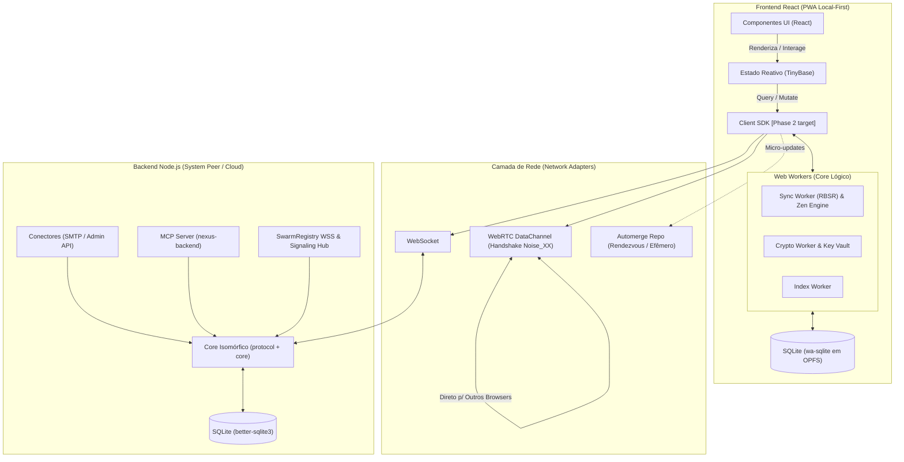
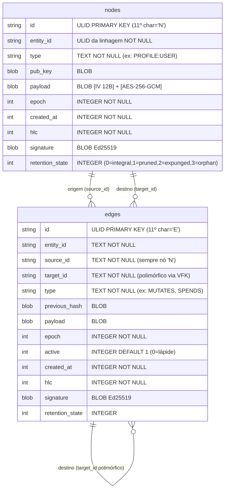
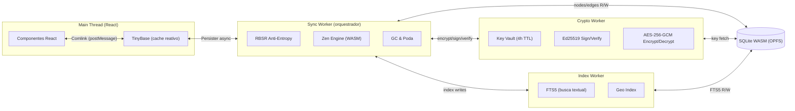

# Visão Arquitetural
Este documento serve como fonte única de contexto arquitetural para o AI assistant, utilizando diagramas para representar as camadas, comunicação e ontologia de dados.

## 1. Topologia Macro

## 2. Entidades do Grafo

A plataforma baseia-se num modelo de grafo append-only replicado suportado por duas estruturas primitivas: `nodes` e `edges`.

### Subtipos de Nós (campo `type`)

| Categoria | Subtipos Canônicos |
| :--- | :--- |
| **PROFILE** | `AUTHENTICATION`, `PERSONA`, `ORGANIZATION`, `SYSTEM` |
| **CONTENT** | `DOCUMENT`, `MESSAGE`, `INTENT`, `THEME`, `TRANSLATION` |
| **ASSET** | `BALANCE_STATE`, `INVENTORY`, `PERMISSION`, `ROLE`, `CONSENT`, `LOCK`, `INVITE`, `PIN` |
| **SPECIFICATION** | `SCHEMA`, `WORKFLOW`, `NETWORK_GOVERNANCE` |

### Exemplos de Arestas (campo `type`)

- **`MUTATES`**: atualiza versão (liga nó anterior à nova versão)
- **`SPENDS`**: ancora débito (aponta para `nodes.id` específico do asset a ser gasto)
- **`CREDITS`**: ancora crédito (aponta para `entity_id` de destino)
- **`AUTHORED`**: estabelece autoria, fundamental pois toda entidade tem `AUTHORED`
- **`DELEGATED_TO`**: delegação de capability
- **`GOVERNED_BY`**: aplicação de `SPECIFICATION`
- **`PARTICIPATES_IN:*:*`**: pertencimento a grupos/projetos
- **`VOUCHES_FOR`**: delega confiança (fluxo de convite `ASSET:INVITE`)

## 3. Web Workers Communication Stack

## 4. Mapeamento de Restrições Arquiteturais

Para garantir que a base seja estruturada conforme estipulado nos cadernos e RFCs da Plataforma V0.41, existem restrições estritas durante a implementação que o Agente ou Desenvolvedor de Software deve obedecer.

> [!IMPORTANT]
> - **O Frontend nunca acessa o banco de dados diretamente:** Componentes React lêem e manipulam estado **exclusivamente através do TinyBase**. O TinyBase é alimentado pelos Workers que controlam a lógica da porta de Storage (`wa-sqlite`).
> - **Zero "Drift de Protocolo" entre Cliente e Servidor:** O Backend Node.js NÃO reimplementa a lógica de negócio em controladores soltos. Ele importa e executa estritamente `@plataforma/protocol` e `@plataforma/core`. 
> - **Imutabilidade Dupla e Causalidade Lógica:** Nunca faça `UPDATE` SQL sobrescrevendo registros da tabela persistente. Toda mudança gera um novo nó temporal assinado no Grafo, conectado ao hash anterior.

> [!WARNING]
> - **Limites do Automerge Repo:** O Automerge é usado *unicamente* como trilha de rede colaborativa para Rendezvous e micro-updates em RAM de edição conjunta ao vivo. Ele **nunca** deve persistir o grafo ou ser o núcleo central da aplicação.
> - **Controle Capability-Based (UCAN):** Tokens UCAN carregam permissões, não chaves criptográficas. As chaves AES são retidas em memória via **Key Vault** e distribuídas dinamicamente, expirando a cada 4 horas (TTL). 
> - **Prevenção de Duplo-Gasto (Atomicidade no P2P):** O "Backend" em Node.js não possui exclusividade na atomicidade das transações financeiras. A não-violação do sistema baseia-se na `Invariante T1` e **Zen Engine** embarcado, validados antes do commit via consistência de regras `SPECIFICATION` e resolução estrutural de conflitos por linhagem determinística, provados pela assinatura de um Quórum (Agente do Sistema em caso de modelo corporativo).
